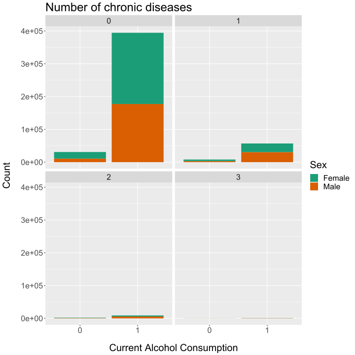
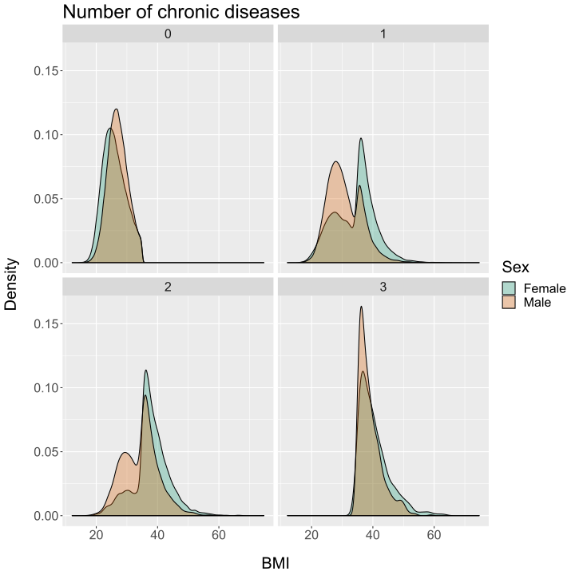
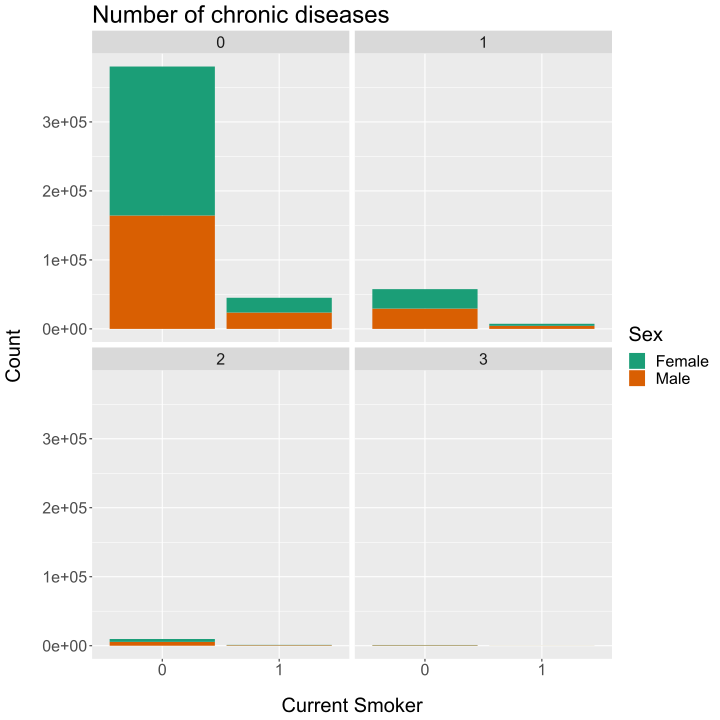

<<<<<<< HEAD
# Descriptive analysis: tables and plots
## Table 1: whole dataset
=======
# Descriptive tables and plots
## Table 1
|                        	| Female:0      	| Male:0        	| Female:1     	| Male:1       	| Female:2     	| Male:2       	| Female:3     	| Male:3       	| p      	|
|------------------------	|---------------	|---------------	|--------------	|--------------	|--------------	|--------------	|--------------	|--------------	|--------	|
| n                      	| 237349        	| 188086        	| 31114        	| 33915        	| 4560         	| 6394         	| 449          	| 788          	|        	|
| Birth year (mean (sd)) 	| 1951.9 (8.0)  	| 1952.0 (8.3)  	| 1950.6 (7.9) 	| 1948.7 (7.5) 	| 1948.7 (7.1) 	| 1947.5 (6.7) 	| 1947.4 (6.4) 	| 1947.3 (6.1) 	| <0.001 	|
| BMI (mean (sd))        	| 25.9 (3.7)    	| 27.0 (3.3)    	| 34.2 (6.7)   	| 30.9 (5.5)   	| 37.8 (6.0)   	| 34.5 (5.9)   	| 40.5 (5.0)   	| 39.1 (3.7)   	| <0.001 	|
| Current Smoker (%)     	| 21395 (9.0)   	| 23720 (12.6)  	| 2937 (9.4)   	| 4465 (13.2)  	| 438 (9.6)    	| 777 (12.2)   	| 53 (11.8)    	| 98 (12.4)    	| <0.001 	|
| Current Alcohol (%)    	| 217113 (91.5) 	| 177366 (94.3) 	| 26283 (84.5) 	| 30695 (90.5) 	| 3424 (75.1)  	| 5545 (86.7)  	| 298 (66.4)   	| 661 (83.9)   	| <0.001 	|
| MI (%)                 	| 0 (0.0)       	| 0 (0.0)       	| 1638 (5.3)   	| 6856 (20.2)  	| 529 (11.6)   	| 2049 (32.0)  	| 133 (29.6)   	| 404 (51.3)   	| <0.001 	|
| Angina (%)             	| 0 (0.0)       	| 0 (0.0)       	| 3179 (10.2)  	| 5166 (15.2)  	| 996 (21.8)   	| 1489 (23.3)  	| 229 (51.0)   	| 280 (35.5)   	| <0.001 	|
| Stroke (%)             	| 0 (0.0)       	| 0 (0.0)       	| 2169 (7.0)   	| 2802 (8.3)   	| 459 (10.1)   	| 599 (9.4)    	| 87 (19.4)    	| 104 (13.2)   	| <0.001 	|
| Diabetes (%)           	| 0 (0.0)       	| 0 (0.0)       	| 6544 (21.0)  	| 10161 (30.0) 	| 3470 (76.1)  	| 5173 (80.9)  	| 449 (100.0)  	| 788 (100.0)  	| <0.001 	|
| Obese (%)              	| 0 (0.0)       	| 0 (0.0)       	| 17584 (56.5) 	| 8930 (26.3)  	| 3666 (80.4)  	| 3478 (54.4)  	| 449 (100.0)  	| 788 (100.0)  	| <0.001 	|

 
 
 
 
 ## Multi-morbid disease intersections
 
 ## Whole cohort disease intersections
 
